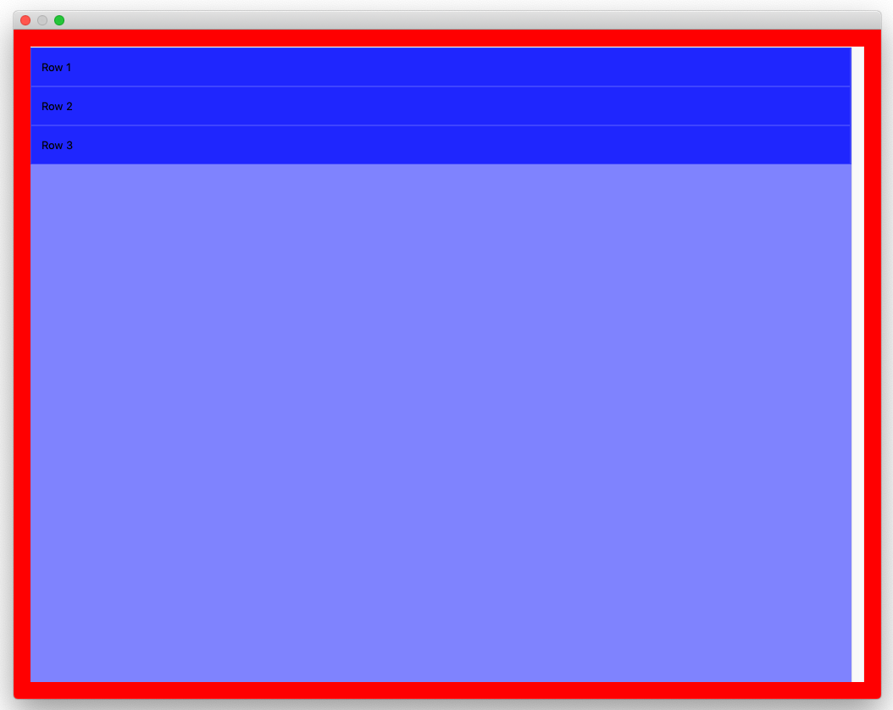

Xamarin Forms macOS `ListView` does not support transparent background (or any alpha less than 1).

Additionally, cells seems to have their backgroudn set to the background of the background of the `ListView` by default, again causing problems when alpha is less than 0.

```csharp
    public class MainPage : ContentPage
    {
        public MainPage()
        {
            BackgroundColor = Color.Red;
            Content = new ListView
            {
                Margin = new Thickness(20),
                BackgroundColor = Color.FromRgba(0, 0, 1, 0.5), 
                ItemsSource = new string[] { "Row 1", "Row 2", "Row 3" }
            };
        }
    }
```

